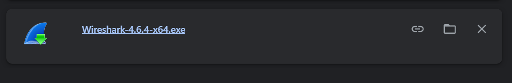
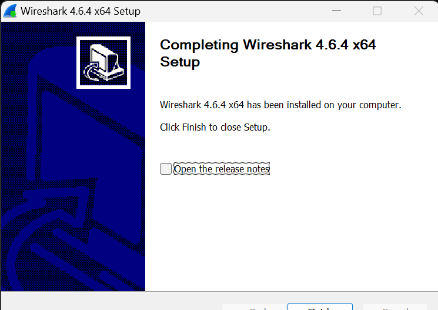
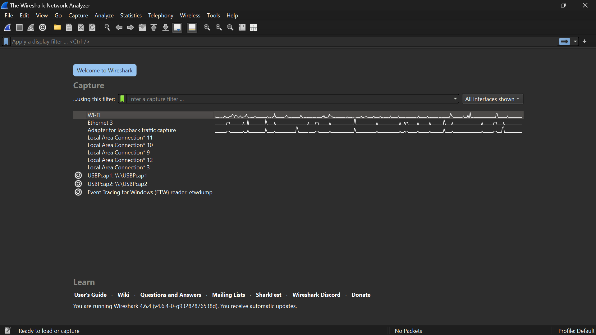
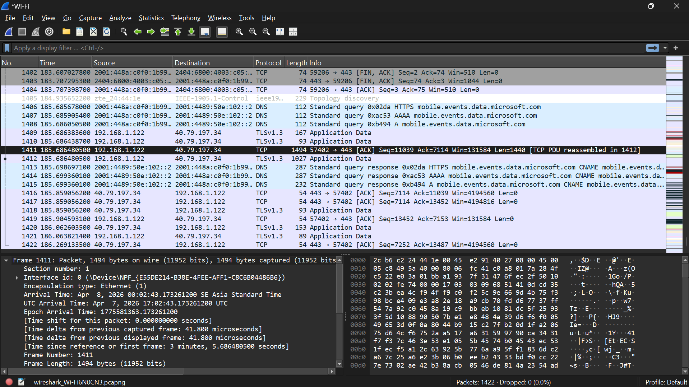
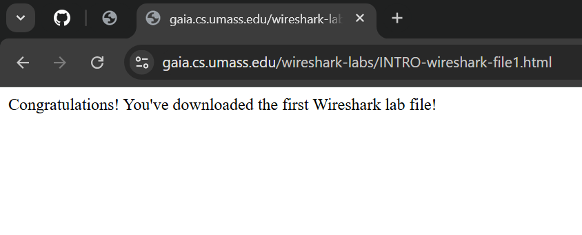
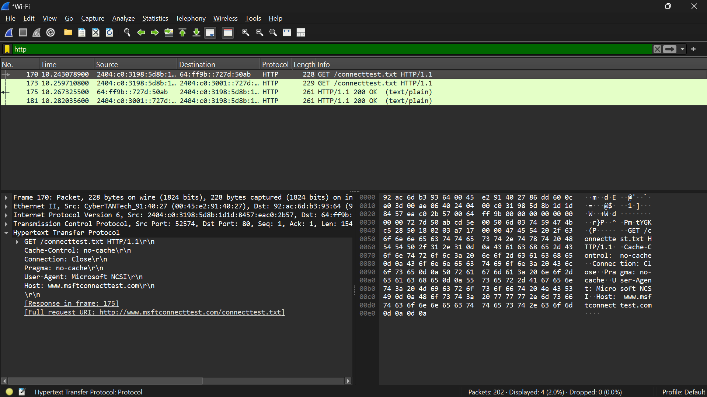

# Laporan Praktikum Jarkom Week 1

## Tujuan Praktikum
Instalasi Wireshark

## Langkah Percobaan
1. Install ISO Wireshark
2. Instalasi Wireshark
3. Jalankan Wireshark
4. Membuka interface (wifi) Wireshark
5. Search https://gaia.cs.umass.edu/wireshark-labs/INTRO-wireshark-file1.html
6. Cek pesan HTTP GET

## Lampiran
Hasil Percobaan :

