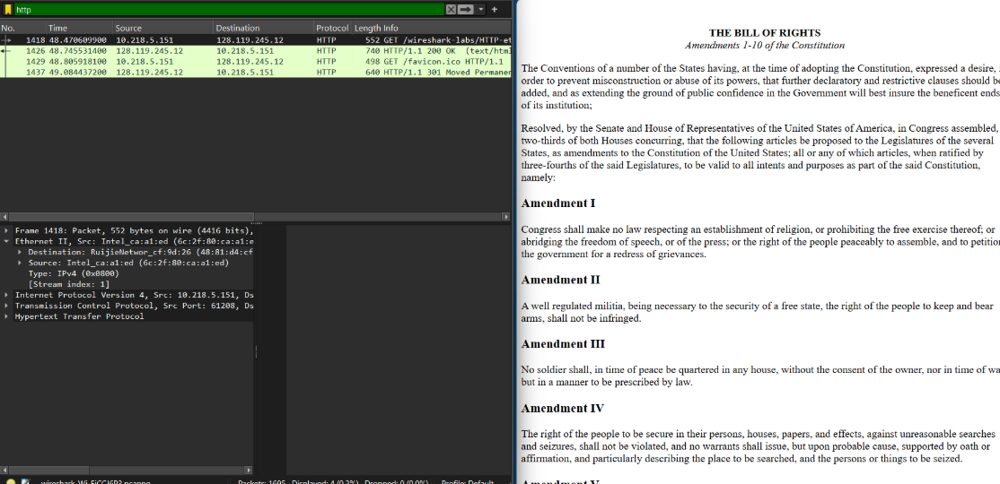

## Laporan Praktikum Jarkom

## Modul 13
NAMA : Rizqullah Izzul Ibad Gheaz
 
NIM : 103072400033

# Langkah Percobaan
1. 13.1

# Lampiran
1. Menangkap dan Menganalisis Frame Ethernet

Hasil Analisis Frame Ethernet

2. Melihat Isi ARP Cache
Hasil Perintah ARP

3. Mengamati Paket ARP Menggunakan Wireshark
Hasil Capture Paket ARP

