# Laporan Praktikum Jaringan Komputer Modul 4

## Tujuan
memahami cara kerja DNS menggunakan Wireshark dan CMD

## Percobaan Praktikum
## 4.2 Nslookup
Langkah Praktikum
1. Jalankan nslookup untuk mendapatkan alamat ip Novosibirsk State University dan alamat ip nya adalah 84.237.49.123

# Hasil Pengujian
Pengujian yang dilakukan terhadap server web Novosibirsk State University sebagai perwakilan dari server Eropa / Eurasia dan hasilnya:

- Domain: www.nsu.ru
- Alamat IP (IPv4): 84.237.49.123
- Server DNS yang Menjawab: 192.168.18.1
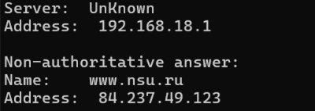

2. Menjalankan nslookup agar mengetahui server DNS otoratif dari University of Cambridge. Untuk pengujian server di Eropa, dilakukan pengecekan terhadap domain University of Cambridge (Inggris) menggunakan opsi -type=NS
# Pengamatan
terdapat beberapa Name Server otoritatif yang mengelola domain cam.ac.uk, di antaranya:
-auth0.dns.cam.ac.uk dengan alamat IP: 131.111.8.37
- auth1.dns.cam.ac.uk dengan alamat IP: 131.111.12.37
- dns0.cl.cam.ac.uk
- ns1.mythic-beasts.com
# Analisis
Daftar tersebut menunjukkan server-server yang memiliki otoritas penuh atas informasi DNS di lingkungan University of Cambridge. Alamat IP 131.111.8.37 (auth0) akan digunakan sebagai referensi untuk melakukan query pada langkah selanjutnya
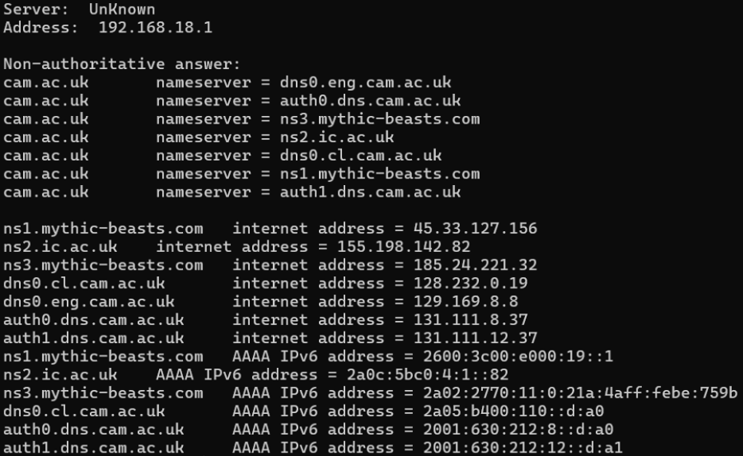

3. Menjalankan nslookuip mencari tahu informasi mengenai server email dari Yahoo!. Alamat ip nya adalah 131.111.8.37

tahap ini dilakukan percobaan untuk mencaritahu informasi alamat ip www.nsu.ru (Rusia) dengan menggunakan server DNS milik  University of Cambridge (131.111.8.37) sebagai perantara (resolver)

# Hasil Pengamatan
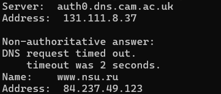
- nslookup www.nsu.ru 131.111.8.37
- Munculnya pesan "Non-authoritative answer" terjadi karena server auth0.dns.cam.ac.uk bukanlah Name Server utama yang secara resmi mengelola domain nsu.ru.
- eskipun bukan server utama, server tersebut tetap berhasil menjawab dengan memberikan alamat IP (84.237.49.123). Hal ini terjadi karena server kemungkinan mengambil data tersebut dari cache (memori sementara) hasil pencarian pengguna lain sebelumnya, atau server tersebut mengizinkan recursive query untuk mencarikan jawaban di internet atas nama Anda.
- Munculnya pesan "DNS request timed out" di tengah proses menunjukkan adanya sedikit kendala. Biasanya hal ini terjadi karena nslookup secara otomatis mencoba mencari tipe data lain secara bersamaan , dan permintaan tambahan tersebut gagal atau tidak direspons oleh firewall. Namun, pencarian utama untuk alamat IPv4 tetap berhasil.

## 4.3 Ipconfig
# Langkah
1. ketik ipconfig saja maka akan muncul informasi mengenai TCP/IP termasuk alamat IP Anda, alamat server DNS jenis adaptor dan sebagainya
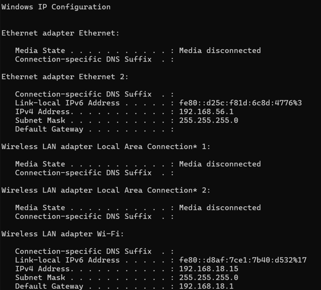
2. Lanjutkan dengan ipconfig /all maka akan muncul dari nama device atau host name, di bagian wifi dapat melihat ip4v address, subnet mask, dns server tidak hanya satu juga ada lebih untuk cadangan, dll
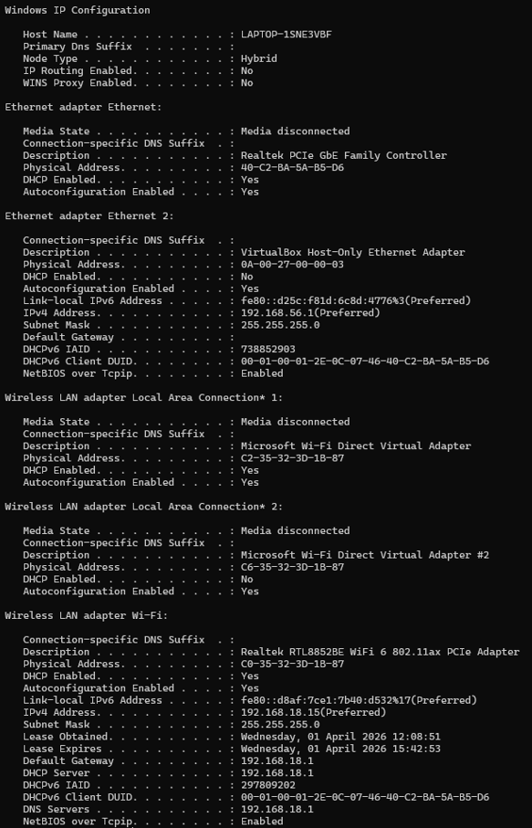
3. Lalu ketikan ipconfig /displaydns akan memunculkan informasi DNS yang tersimpan dalam host. Hasil yang didapatkan akan menampilkan record dan sisa Time To Live (TTL) dalam
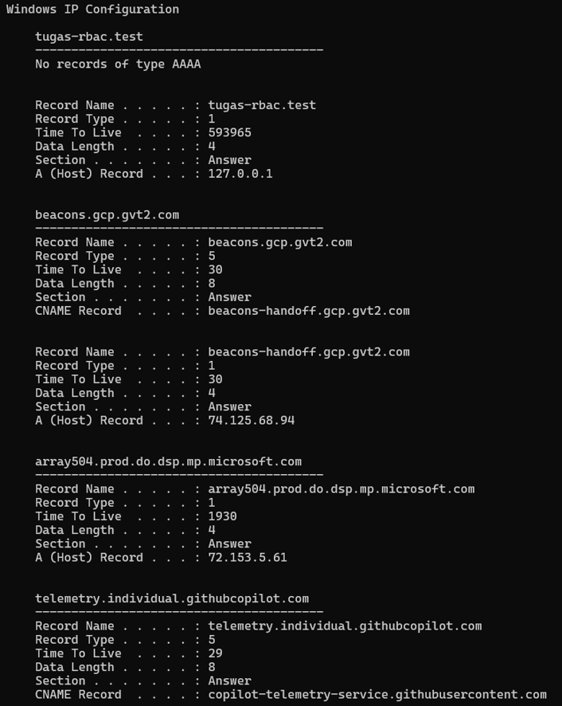
4. Terakhir untuk menghapus catatan ketik ipconfig /flushdns. Akan Mengosongkan catatan DNS berarti menghapus semua record dan memuat ulang record dari file host
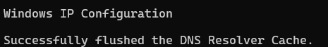

## 4.4 Tracing DNS dengan Wireshark
# Langkah
- Gunakan ipconfig untuk mengosongkan catatan DNS di host
- Buka browser Anda dan kosongkan cache-nya
- Buka Wireshark dan masukkan "ip.addr == 192.168.1.5" ke dalam filter
- Mulai pengambilan paket di Wireshark
- Dengan browser Anda, kunjungi halaman web http://www.ietf.org
- Hentikan pengambilan paket

# Analisis dan Jawab Soal
1. Sudah tertemukan permintaan dns dan balasannya. Pesan dikirim melalui UDP
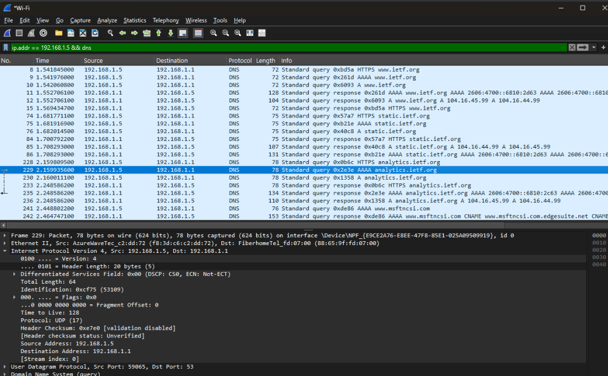

2. Port tujuan pada permintaan dns yaitu 53. Port sumber pada pesan balasannya yaitu 59065
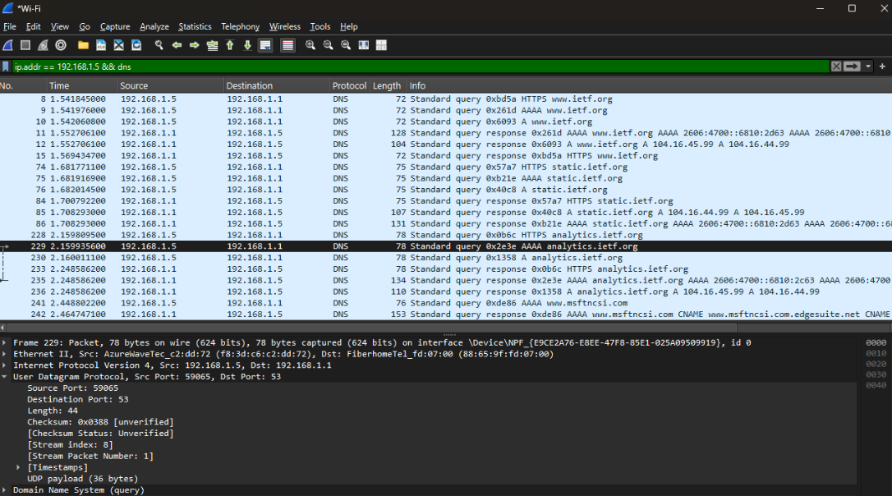
3. Sesuaikan pesan permintaan DNS dari alamat IP dan alamat IP server DNS lokal
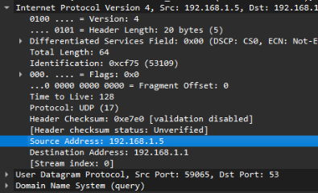
4. Pada pesan permintaan jenis atau typenya adalah AAAA. Tidak mengandung jawaban atau answer
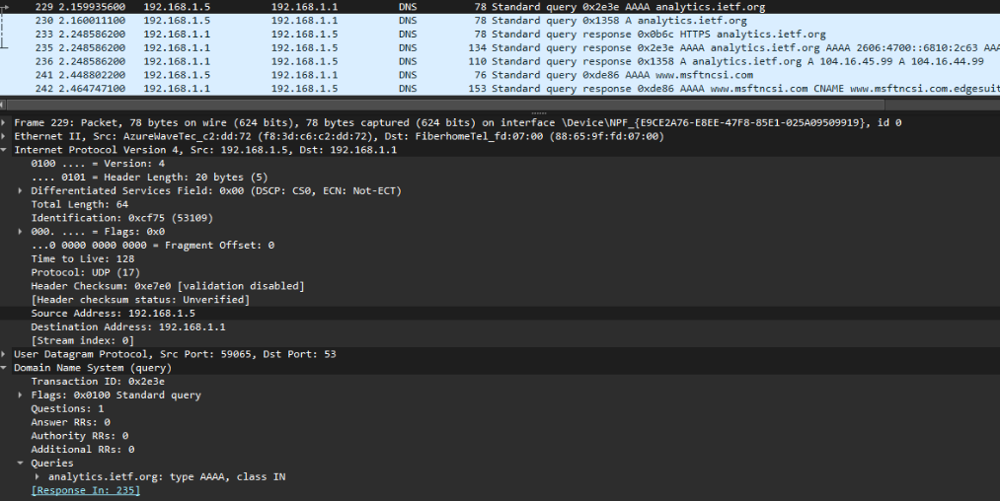
5. Ada 2 jawaban atau answer. Isinya sesuai di gambar dibawah

6. Lalu cocokkan destination TCP SYN dengan DNS bagian answer
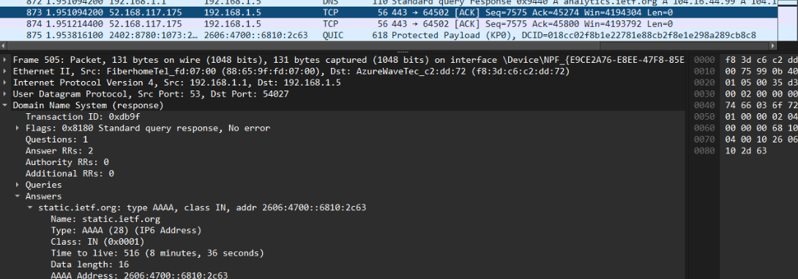
7. Host tidak selalu mengirimkan dns baru untuk setiap objek di suatu web karena browser sudah menyimpan hasil resolusi dns dalam page
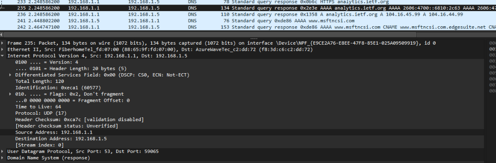

# Bagian 2 dari 4.4
Jawab (Download dari file dns-ethereal-trace-2)

1. Port tujuannya itu 53 dan sumbernya itu 3742
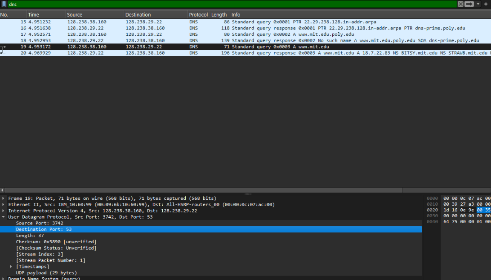
2. Ke alamat ip 128.238.29.22, bukan alamat default ip server DNS lokal yaitu 128.238.38.160
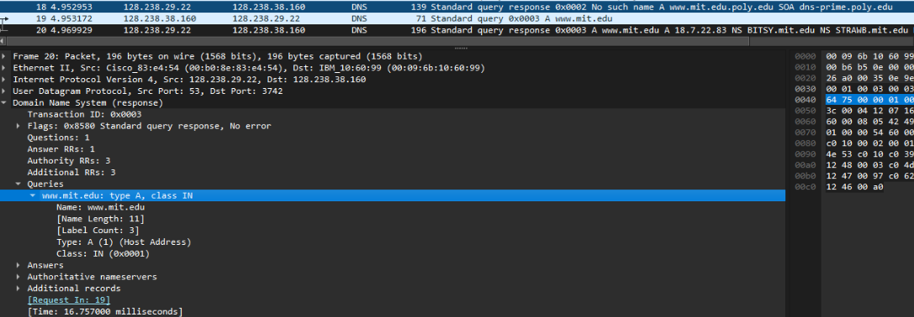
3. Termasuk jenis atau type A, tidak ada jawaban atau answer
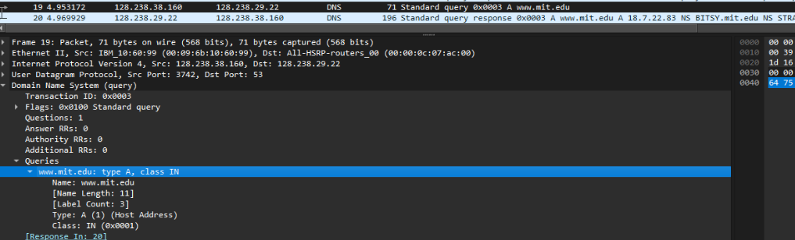
4. Hanya ada satu jawaban atau answer
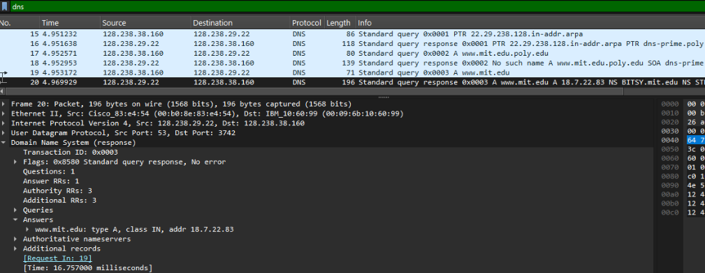

# Bagian 3 dari 4.4
Jawab 

1. Port tujuannya itu 53 dan sumbernya 57219
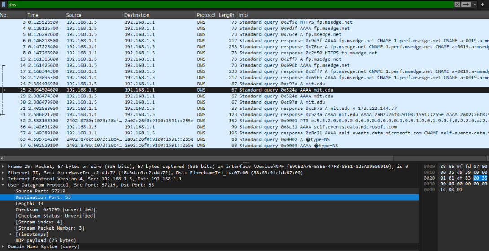
2. Jenis atau tipe AAAA, dan ada dua jawaban
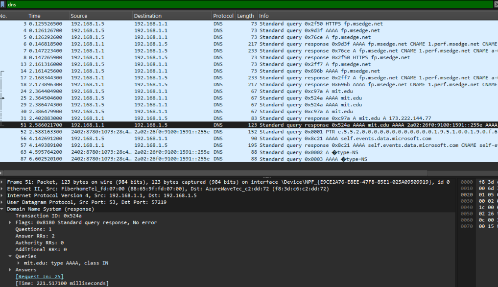
3. server DNS tidak menyertakan Additional Records yang berisi daftar Name Server otoritatif untuk domain mit.edu. Namun, pesan tersebut memberikan jawaban atas query AAAA (tipe IPv6) dengan memberikan dua alamat IPv6 untuk mit.edu, yaitu:
- 2a02:26f0:9100:1591::255e
- 2a02:26f0:9100:159d::255e
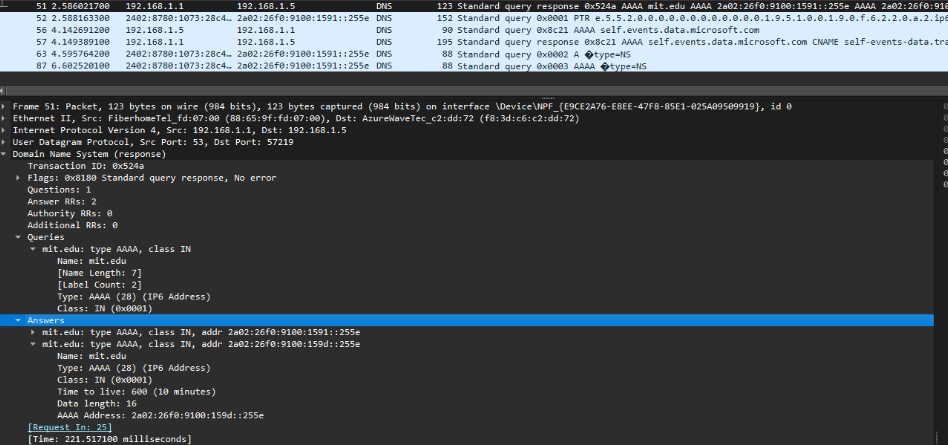

# Bagian 4 dari 4.4
jawab
1. Ke alamat ip 18.0.72.3 bukan default alamat IP server DNS lokal karena defaultnya 192.168.1.5
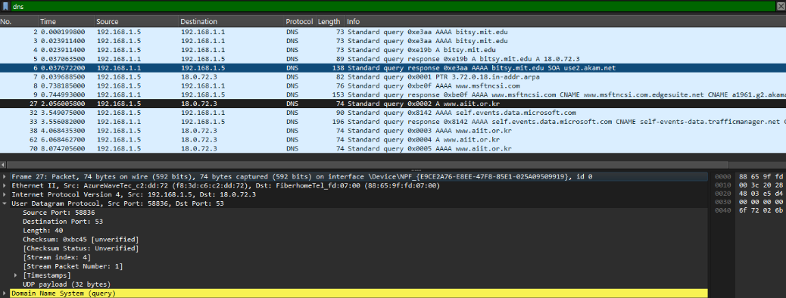
2. Berjenis atau tipe AAAA, dan ya mengandung jawaban 
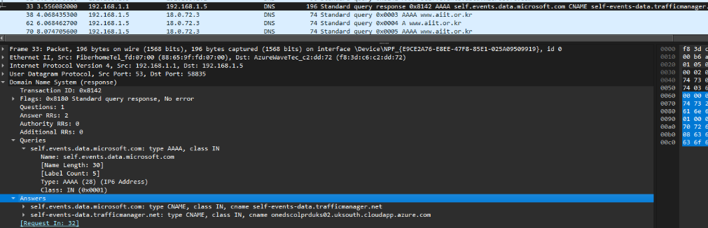
3. ada dua jawaban dan isinya sesuai di screenshot
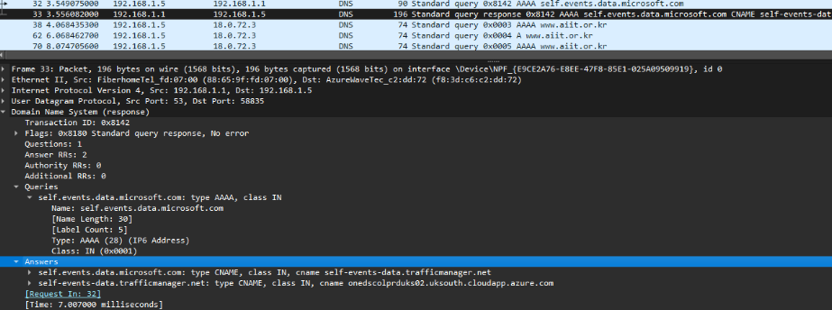

